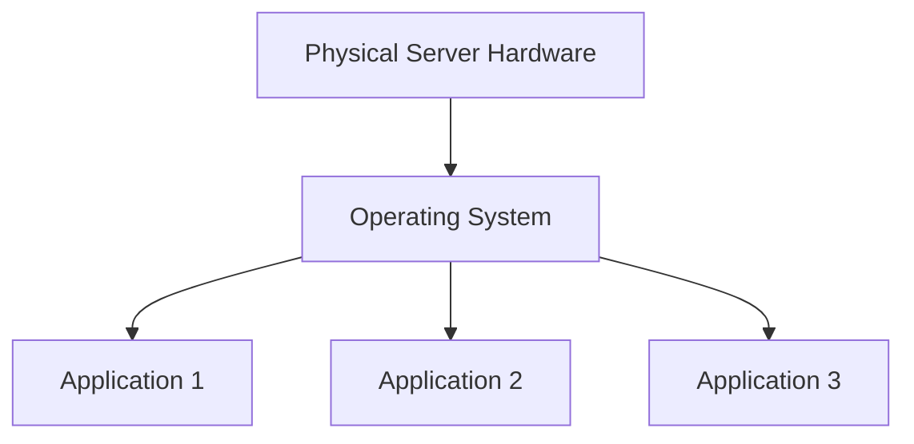
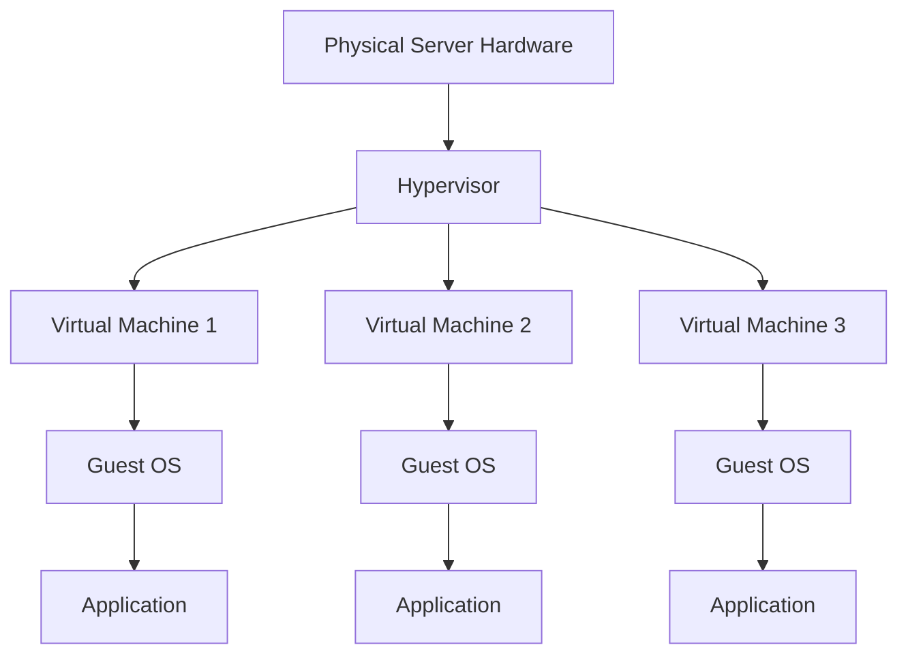
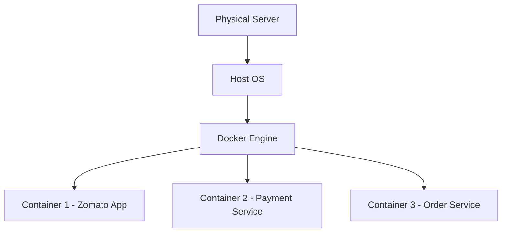
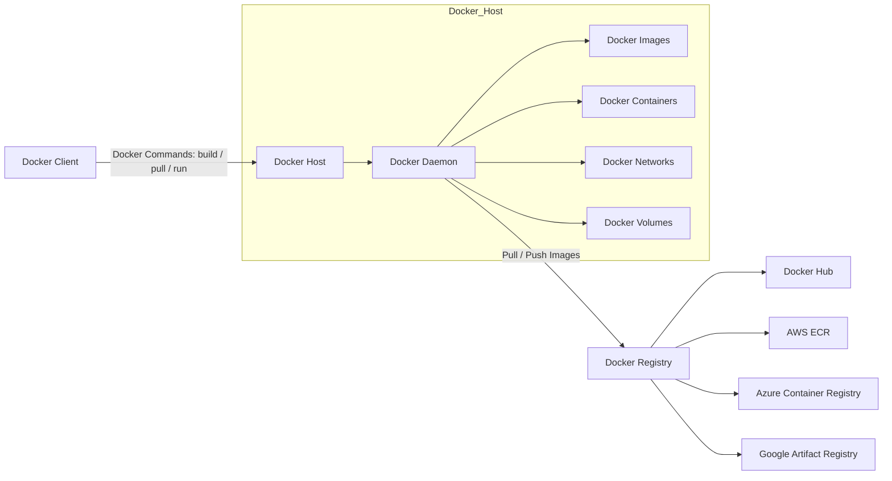
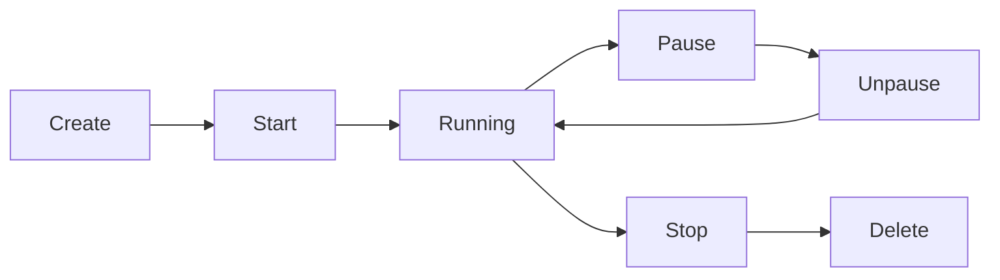

# Docker Documentation

# DevOps Architecture Evolution


This project explains the **evolution of modern application deployment architectures** used in DevOps.

We explore how infrastructure evolved from:

1. **Traditional Physical Servers (Gen-1)**
2. **Virtual Machines & Hypervisors (Gen-2)**
3. **Containerization with Docker (Gen-3)**

Understanding these architectures is essential for **DevOps Engineers, Cloud Engineers, and Software Developers**.

---

# Table of Contents

- [Docker Documentation](#docker-documentation)
- [DevOps Architecture Evolution](#devops-architecture-evolution)
- [Table of Contents](#table-of-contents)
- [Overview](#overview)
- [Gen-1 Architecture (Traditional Physical Server)](#gen-1-architecture-traditional-physical-server)
  - [Architecture Diagram](#architecture-diagram)
  - [Layers Explanation](#layers-explanation)
    - [Physical Layer](#physical-layer)
    - [Operating System Layer](#operating-system-layer)
    - [Application Layer](#application-layer)
  - [Drawbacks](#drawbacks)
- [Gen-2 Architecture (Virtualization)](#gen-2-architecture-virtualization)
  - [Virtualization Architecture](#virtualization-architecture)
- [What is a Hypervisor?](#what-is-a-hypervisor)
  - [Advantages](#advantages)
  - [Drawbacks](#drawbacks-1)
- [Gen-3 Architecture (Containerization)](#gen-3-architecture-containerization)
  - [Container Architecture](#container-architecture)
- [Example Containers](#example-containers)
  - [Advantages of Containers](#advantages-of-containers)
- [Architecture Comparison](#architecture-comparison)
- [Real-World Examples](#real-world-examples)
- [Technologies Used](#technologies-used)
- [Conclusion](#conclusion)
- [Docker Hub](#docker-hub)
- [Running Containers](#running-containers)
  - [Detached Mode](#detached-mode)
    - [Options](#options)
  - [Interactive Mode](#interactive-mode)
    - [Options](#options-1)
- [Port Mapping](#port-mapping)
  - [Automatic Port Mapping](#automatic-port-mapping)
  - [Manual Port Mapping](#manual-port-mapping)
- [Naming Containers](#naming-containers)
- [Stopping Containers](#stopping-containers)
- [Deleting Containers](#deleting-containers)
- [Docker Architecture](#docker-architecture)
  - [1. Docker Client](#1-docker-client)
  - [2. Docker Host](#2-docker-host)
  - [3. Docker Registry](#3-docker-registry)
- [Docker Workflow (Step by Step)](#docker-workflow-step-by-step)
- [Docker Registry](#docker-registry)
  - [Types of Registry](#types-of-registry)
    - [Public Registry](#public-registry)
    - [Private Registry](#private-registry)
- [Docker Container Lifecycle](#docker-container-lifecycle)
- [Container Lifecycle Commands](#container-lifecycle-commands)
  - [Create Container](#create-container)
  - [Start Container](#start-container)
  - [Run Container](#run-container)
  - [Pause Container](#pause-container)
  - [Unpause Container](#unpause-container)
  - [Stop Container](#stop-container)
  - [Stop All Containers](#stop-all-containers)
  - [Delete Container](#delete-container)
  - [Delete All Containers](#delete-all-containers)
  - [Kill Container](#kill-container)

---

# Overview

Modern DevOps infrastructure evolved to solve problems like:

* Resource wastage
* Application dependency conflicts
* Slow deployments
* Poor scalability

The **solution evolved across three generations**:

| Generation | Technology       | Key Idea                          |
| ---------- | ---------------- | --------------------------------- |
| Gen-1      | Physical Servers | Applications run directly on OS   |
| Gen-2      | Virtual Machines | Multiple OS using Hypervisor      |
| Gen-3      | Containers       | Lightweight isolated environments |

---

# Gen-1 Architecture (Traditional Physical Server)

In **Gen-1 architecture**, applications run **directly on a physical server** along with the operating system.

There is **no virtualization or container layer**.

---

## Architecture Diagram



---

## Layers Explanation

### Physical Layer

Actual **hardware server located in a data center**.

Components include:

* CPU
* RAM
* Storage
* Network Interface

Example: Enterprise Data Center Servers.

---

### Operating System Layer

Only **one operating system** runs on the server.

Examples:

* Linux
* Windows Server

All applications **share the same OS kernel**.

---

### Application Layer

Applications run directly on the OS and depend on:

* System libraries
* Runtime environments

Examples:

* Java applications
* Python services
* Node.js applications

---

## Drawbacks

* Application conflicts
* Dependency issues
* Poor scalability
* Resource wastage
* Server crashes affect all applications

---

# Gen-2 Architecture (Virtualization)

Gen-2 introduced **Virtual Machines (VMs)** using **Hypervisors**.

Multiple VMs run on **one physical server**, each with **its own OS and applications**.

---

## Virtualization Architecture



---

# What is a Hypervisor?

A **Hypervisor** is software that creates and manages **Virtual Machines**.

It allows **multiple operating systems to run on one physical server**.

Examples:

| Hypervisor | Provider  |
| ---------- | --------- |
| VMware     | VMware    |
| KVM        | Linux     |
| Hyper-V    | Microsoft |
| VirtualBox | Oracle    |

---

## Advantages

* VM isolation
* Better resource utilization
* Easy VM creation
* VM snapshots for backup
* Multiple OS support

---

## Drawbacks

* Each VM requires full OS
* High CPU and memory usage
* VM startup takes minutes
* Multiple OS kernels waste resources

---

# Gen-3 Architecture (Containerization)

Gen-3 introduced **containers**.

Containers package an application with its dependencies but **share the host OS kernel**.

This makes them **much lighter and faster than virtual machines**.

---

## Container Architecture



---

# Example Containers

| Container   | Service            |
| ----------- | ------------------ |
| Container 1 | Zomato Application |
| Container 2 | Payment Service    |
| Container 3 | Order Service      |

Each container includes:

* Application
* Runtime
* Libraries
* Dependencies

---

## Advantages of Containers

* Lightweight
* Faster startup
* High scalability
* Consistent environments
* Easy CI/CD integration
* Ideal for microservices

---

# Architecture Comparison

| Feature             | Gen-1 | Gen-2  | Gen-3     |
| ------------------- | ----- | ------ | --------- |
| Isolation           | No    | Yes    | Yes       |
| Resource Efficiency | Low   | Medium | High      |
| Startup Time        | Slow  | Medium | Fast      |
| Scalability         | Poor  | Good   | Excellent |

---

# Real-World Examples

| Company | Technology                 |
| ------- | -------------------------- |
| Netflix | Microservices + Containers |
| Amazon  | Cloud Virtual Machines     |
| Google  | Kubernetes Containers      |
| Uber    | Docker + Microservices     |

---

# Technologies Used

* Linux
* Docker
* Virtual Machines
* Hypervisors
* Cloud Computing
* DevOps Practices

---

# Conclusion

Infrastructure evolved from:

**Physical Servers → Virtual Machines → Containers**

Containers are now the **standard for modern cloud-native applications**.

They enable:

* Faster deployments
* Better scalability
* Improved resource efficiency
* Reliable DevOps pipelines


# Docker Hub

Docker Hub is the **default public registry** where users can store, share, push, and pull Docker images.

Example:

```bash
docker pull nginx
```

This command downloads the **NGINX image from Docker Hub** to the local machine.

---

# Running Containers

Containers can run in **detached mode** or **interactive mode**.

---

## Detached Mode

Runs the container in the background.

```bash
docker run -d -P nginx:1.29
```

### Options

`-d`
Runs container in **background (detached mode)**.

`-P`
Automatically maps **container ports to random host ports**.

Used for long-running services such as:

* NGINX
* Apache
* Databases

---

## Interactive Mode

Runs the container interactively.

```bash
docker run -it nginx
```

### Options

`-i`
Keeps **STDIN open**.

`-t`
Allocates a **pseudo terminal**.

Used when interacting with a **container shell**.

---

# Port Mapping

Port mapping connects **host machine ports with container ports**.

---

## Automatic Port Mapping

```bash
docker run -d -P nginx
```

* Maps exposed container ports to **random host ports**
* Mostly used for **testing**

---

## Manual Port Mapping

```bash
docker run -d -p 8880:80 nginx
```

Format:

```
host_port : container_port
```

Example:

```
http://localhost:8880
```

---

# Naming Containers

You can assign a name while creating a container.

```bash
docker run -d -P --name test1 nginx
```

Creates a container named **test1**.

---

# Stopping Containers

```bash
docker stop <container_id>
```

Example:

```bash
docker stop 4f23ab
```

Stops the running container.

---

# Deleting Containers

```bash
docker rm -f <container_id>
```

Removes the container forcefully.

---

# Docker Architecture

Docker architecture consists of **three main components**.

Docker Architecture Diagram


## 1. Docker Client

Commands executed by the user:

```
docker build
docker pull
docker run
```

---

## 2. Docker Host

Runs the **Docker Daemon**.

Responsibilities:

* Manage images
* Manage containers
* Manage networks
* Manage volumes

---

## 3. Docker Registry

Stores Docker images.

Examples:

* Docker Hub
* Amazon Elastic Container Registry (ECR)
* Azure Container Registry (ACR)
* Google Artifact Registry

---

# Docker Workflow (Step by Step)

**Step 1**
User executes command:

```
docker pull nginx
```

**Step 2**
Docker Client checks if Docker is running.

**Step 3**
Client sends request to Docker Daemon using **REST API**.

**Step 4**
Docker Daemon contacts Docker Registry.

**Step 5**
Searches for the **nginx image**.

**Step 6**
Pulls image to the **local Docker host**.

**Step 7**
Creates container from the image.

**Step 8**
Configures:

* Networking
* Storage
* CPU & Memory limits
* Isolation using **Namespaces & cgroups**

**Step 9**
Container starts running the application.

---

# Docker Registry

A **Docker Registry** is a repository used to store and distribute Docker images.

## Types of Registry

### Public Registry

Open to everyone.

Example:

* Docker Hub

Images can be pulled **without authentication**.

---

### Private Registry

Access is restricted and requires authentication.

Used by organizations to store **private application images**.

Examples:

* Amazon Elastic Container Registry
* Azure Container Registry
* Google Artifact Registry

---

# Docker Container Lifecycle

Container lifecycle stages:

```
Create → Start → Running → Pause → Unpause → Stop → Delete
```

---

# Container Lifecycle Commands

Docker Container Lifecycle Diagram


Docker Container Lifecycle Commands
Stage	Command
Create	docker create nginx
Start	docker start <container>
Run	docker run nginx
Pause	docker pause <container>
Unpause	docker unpause <container>
Stop	docker stop <container>
Delete	docker rm <container>
Kill	docker kill <container>


## Create Container

```bash
docker create --name test1 nginx
```

---

## Start Container

```bash
docker start <container_name>
```

---

## Run Container

```bash
docker run -d -P --name test2 nginx
```

---

## Pause Container

```bash
docker pause <container_name>
```

---

## Unpause Container

```bash
docker unpause <container_name>
```

---

## Stop Container

```bash
docker stop <container_name>
```

---

## Stop All Containers

```bash
docker stop $(docker ps -aq)
```

---

## Delete Container

```bash
docker rm <container_name>
```

---

## Delete All Containers

```bash
docker rm $(docker ps -aq)
```

---

## Kill Container

```bash
docker kill <container_name>
```
