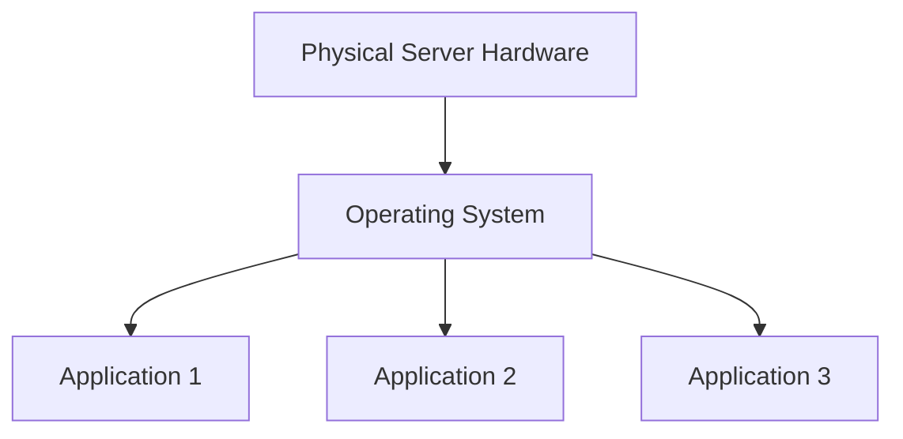
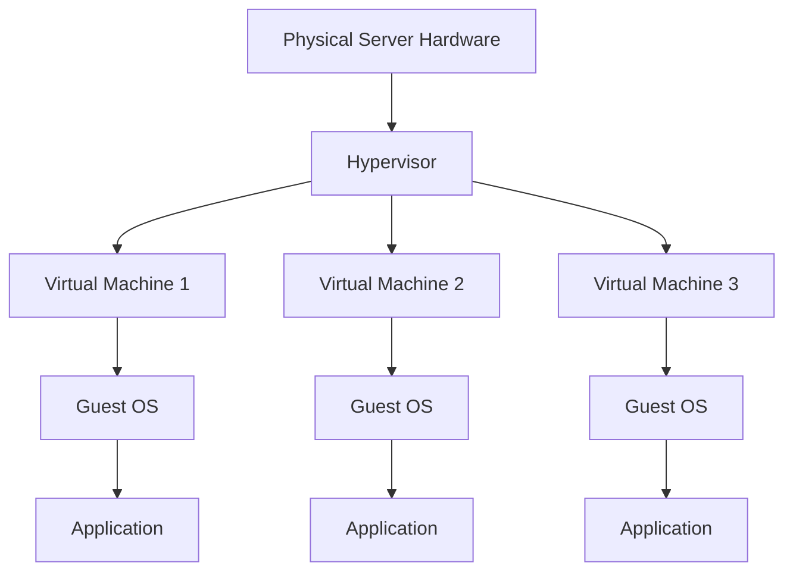
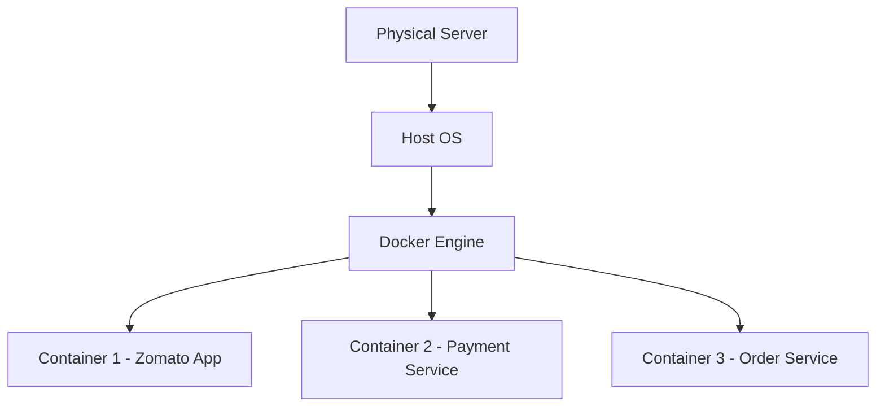
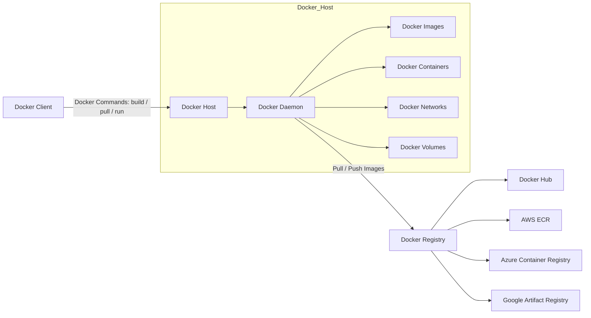
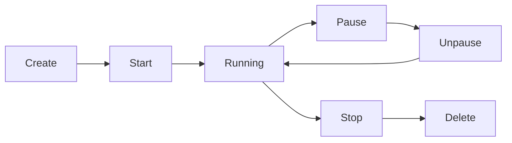

# Docker Documentation

# DevOps Architecture Evolution


This project explains the **evolution of modern application deployment architectures** used in DevOps.

We explore how infrastructure evolved from:

1. **Traditional Physical Servers (Gen-1)**
2. **Virtual Machines & Hypervisors (Gen-2)**
3. **Containerization with Docker (Gen-3)**

Understanding these architectures is essential for **DevOps Engineers, Cloud Engineers, and Software Developers**.

---

# Table of Contents

- [Docker Documentation](#docker-documentation)
- [DevOps Architecture Evolution](#devops-architecture-evolution)
- [Table of Contents](#table-of-contents)
- [Overview](#overview)
- [Gen-1 Architecture (Traditional Physical Server)](#gen-1-architecture-traditional-physical-server)
  - [Architecture Diagram](#architecture-diagram)
  - [Layers Explanation](#layers-explanation)
    - [Physical Layer](#physical-layer)
    - [Operating System Layer](#operating-system-layer)
    - [Application Layer](#application-layer)
  - [Drawbacks](#drawbacks)
- [Gen-2 Architecture (Virtualization)](#gen-2-architecture-virtualization)
  - [Virtualization Architecture](#virtualization-architecture)
- [What is a Hypervisor?](#what-is-a-hypervisor)
  - [Advantages](#advantages)
  - [Drawbacks](#drawbacks-1)
- [Gen-3 Architecture (Containerization)](#gen-3-architecture-containerization)
  - [Container Architecture](#container-architecture)
- [Example Containers](#example-containers)
  - [Advantages of Containers](#advantages-of-containers)
- [Architecture Comparison](#architecture-comparison)
- [Real-World Examples](#real-world-examples)
- [Technologies Used](#technologies-used)
- [Conclusion](#conclusion)
- [Docker Hub](#docker-hub)
- [Running Containers](#running-containers)
  - [Detached Mode](#detached-mode)
    - [Options](#options)
  - [Interactive Mode](#interactive-mode)
    - [Options](#options-1)
- [Port Mapping](#port-mapping)
  - [Automatic Port Mapping](#automatic-port-mapping)
  - [Manual Port Mapping](#manual-port-mapping)
- [Naming Containers](#naming-containers)
- [Stopping Containers](#stopping-containers)
- [Deleting Containers](#deleting-containers)
- [Docker Architecture](#docker-architecture)
  - [1. Docker Client](#1-docker-client)
  - [2. Docker Host](#2-docker-host)
  - [3. Docker Registry](#3-docker-registry)
- [Docker Workflow (Step by Step)](#docker-workflow-step-by-step)
- [Docker Registry](#docker-registry)
  - [Types of Registry](#types-of-registry)
    - [Public Registry](#public-registry)
    - [Private Registry](#private-registry)
- [Docker Container Lifecycle](#docker-container-lifecycle)
- [Container Lifecycle Commands](#container-lifecycle-commands)
  - [Create Container](#create-container)
  - [Start Container](#start-container)
  - [Run Container](#run-container)
  - [Pause Container](#pause-container)
  - [Unpause Container](#unpause-container)
  - [Stop Container](#stop-container)
  - [Stop All Containers](#stop-all-containers)
  - [Delete Container](#delete-container)
  - [Delete All Containers](#delete-all-containers)
  - [Kill Container](#kill-container)
- [🚀 Static Website Deployment using Nginx on AWS EC2 (Ubuntu 24.04)](#-static-website-deployment-using-nginx-on-aws-ec2-ubuntu-2404)
- [📌 Architecture](#-architecture)
- [📋 Prerequisites](#-prerequisites)
- [⚙️ Step 1: Launch EC2 Instance](#️-step-1-launch-ec2-instance)
- [🔑 Step 2: Connect to EC2 Instance](#-step-2-connect-to-ec2-instance)
- [🔄 Step 3: Update System](#-step-3-update-system)
- [📦 Step 4: Install Required Packages](#-step-4-install-required-packages)
- [🌐 Step 5: Download Website Template](#-step-5-download-website-template)
- [📂 Step 6: Extract the Template](#-step-6-extract-the-template)
- [📁 Step 7: Move Files to Nginx Web Directory](#-step-7-move-files-to-nginx-web-directory)
- [🌍 Step 8: Access the Website](#-step-8-access-the-website)
- [📁 Project Structure](#-project-structure)
- [🛠 Technologies Used](#-technologies-used)
- [🚀 Static Website Deployment using Docker on AWS EC2 (Ubuntu 24.04)](#-static-website-deployment-using-docker-on-aws-ec2-ubuntu-2404)
- [📌 Architecture](#-architecture-1)
- [📋 Prerequisites](#-prerequisites-1)
- [⚙️ Step 1: Create EC2 Instance](#️-step-1-create-ec2-instance)
- [🔑 Step 2: Connect to EC2 Instance](#-step-2-connect-to-ec2-instance-1)
- [🐳 Step 3: Install Docker](#-step-3-install-docker)
- [📝 Step 4: Create Dockerfile](#-step-4-create-dockerfile)
- [🏗 Step 5: Build Docker Image](#-step-5-build-docker-image)
- [📦 Step 6: Run Docker Container](#-step-6-run-docker-container)
- [🌐 Step 7: Access the Website](#-step-7-access-the-website)
- [📁 Project Structure](#-project-structure-1)
- [⚠️ Note](#️-note)
- [🛠 Technologies Used](#-technologies-used-1)
- [🚀 Deploy Static HTML/CSS Website using Docker (Lightweight Image) on AWS EC2](#-deploy-static-htmlcss-website-using-docker-lightweight-image-on-aws-ec2)
- [📌 Architecture](#-architecture-2)
- [📋 Prerequisites](#-prerequisites-2)
- [⚙️ Step 1: Create EC2 Instance](#️-step-1-create-ec2-instance-1)
- [🔑 Step 2: Connect to EC2 Instance](#-step-2-connect-to-ec2-instance-2)
- [🐳 Step 3: Install Docker](#-step-3-install-docker-1)
- [📥 Step 4: Download Website Template](#-step-4-download-website-template)
- [📦 Step 5: Extract the Template](#-step-5-extract-the-template)
- [📝 Step 6: Create Dockerfile](#-step-6-create-dockerfile)
- [🏗 Step 7: Build Docker Image](#-step-7-build-docker-image)
- [📦 Step 8: Run Docker Container](#-step-8-run-docker-container)
- [🌐 Step 9: Access the Website](#-step-9-access-the-website)
- [📁 Project Structure](#-project-structure-2)
- [⚡ Why This Method Uses Less Storage](#-why-this-method-uses-less-storage)
- [🛠 Technologies Used](#-technologies-used-2)
- [🚀 Deploy Java Maven Application using Docker (Multi-Stage Build) on AWS EC2](#-deploy-java-maven-application-using-docker-multi-stage-build-on-aws-ec2)
- [📌 Architecture](#-architecture-3)
- [📋 Prerequisites](#-prerequisites-3)
- [⚙️ Step 1: Create EC2 Instance](#️-step-1-create-ec2-instance-2)
- [🔑 Step 2: Connect to EC2](#-step-2-connect-to-ec2)
- [🐳 Step 3: Install Docker](#-step-3-install-docker-2)
- [📥 Step 4: Clone Java Project](#-step-4-clone-java-project)
- [📝 Step 5: Create Dockerfile](#-step-5-create-dockerfile)
- [🏗 Step 6: Build Docker Image](#-step-6-build-docker-image)
- [📦 Step 7: Run Docker Container](#-step-7-run-docker-container)
- [🔍 Step 8: Access Running Container](#-step-8-access-running-container)
- [🌐 Step 9: Access the Application](#-step-9-access-the-application)
- [📁 Project Structure](#-project-structure-3)
- [⚡ Why Multi-Stage Build?](#-why-multi-stage-build)
- [🛠 Technologies Used](#-technologies-used-3)
- [📚 Learning Outcomes](#-learning-outcomes)
- [🚀 Java Maven Application Deployment using Docker (ARG, ENV, USER) on AWS EC2 – Ubuntu 24.04](#-java-maven-application-deployment-using-docker-arg-env-user-on-aws-ec2--ubuntu-2404)
- [📌 Project Overview](#-project-overview)
- [🏗 Architecture Flow](#-architecture-flow)
- [🛠 Technologies Used](#-technologies-used-4)
- [⚙️ Prerequisites](#️-prerequisites)
- [📖 Deployment Steps](#-deployment-steps)
    - [1️⃣ Create EC2 Instance](#1️⃣-create-ec2-instance)
    - [2️⃣ Connect to EC2 Instance](#2️⃣-connect-to-ec2-instance)
    - [3️⃣ Update Package Repository](#3️⃣-update-package-repository)
    - [4️⃣ Install Docker](#4️⃣-install-docker)
    - [5️⃣ Clone Java Maven Project](#5️⃣-clone-java-maven-project)
    - [6️⃣ Navigate to Project Directory](#6️⃣-navigate-to-project-directory)
- [📝 Create Dockerfile](#-create-dockerfile)
    - [7️⃣ Build Docker Image](#7️⃣-build-docker-image)
    - [8️⃣ Run Docker Container](#8️⃣-run-docker-container)
    - [9️⃣ Verify Running Containers](#9️⃣-verify-running-containers)
    - [🔟 Access Container Shell](#-access-container-shell)
- [🌐 Access the Application](#-access-the-application)
- [📂 Project Structure](#-project-structure-4)
- [🔑 Docker Concepts Used](#-docker-concepts-used)
    - [ARG](#arg)
    - [ENV](#env)
    - [USER](#user)
    - [LABEL](#label)
- [📚 Learning Outcomes](#-learning-outcomes-1)
- [🚀 NopCommerce Deployment on Ubuntu 24.04 (.NET 9)](#-nopcommerce-deployment-on-ubuntu-2404-net-9)
  - [📌 Overview](#-overview)
- [🏗 Architecture](#-architecture-4)
- [🧰 Technology Stack](#-technology-stack)
- [📋 Prerequisites](#-prerequisites-4)
- [⚡ Deployment Steps](#-deployment-steps-1)
  - [1️⃣ Update System Packages](#1️⃣-update-system-packages)
  - [2️⃣ Install Docker](#2️⃣-install-docker)
  - [3️⃣ Add User to Docker Group](#3️⃣-add-user-to-docker-group)
  - [4️⃣ Install .NET 9 SDK](#4️⃣-install-net-9-sdk)
  - [5️⃣ Clone the Repository](#5️⃣-clone-the-repository)
  - [6️⃣ Publish the Application](#6️⃣-publish-the-application)
  - [7️⃣ Navigate to Publish Directory](#7️⃣-navigate-to-publish-directory)
  - [8️⃣ Run the Application](#8️⃣-run-the-application)
- [🌐 Access the Application](#-access-the-application-1)
- [📁 Project Structure](#-project-structure-5)
- [🧪 Useful Commands](#-useful-commands)
    - [Check running processes](#check-running-processes)
    - [Stop the application](#stop-the-application)
- [🔥 Firewall Configuration (Optional)](#-firewall-configuration-optional)
- [🚀 Production Recommendations](#-production-recommendations)
- [📚 References](#-references)
- [🐳 Deploying NopCommerce (.NET 9) Using Dockerfile on Ubuntu 24.04](#-deploying-nopcommerce-net-9-using-dockerfile-on-ubuntu-2404)
- [📌 Overview](#-overview-1)
- [🏗 Architecture](#-architecture-5)
- [🧰 Technology Stack](#-technology-stack-1)
- [📋 Prerequisites](#-prerequisites-5)
- [⚡ Implementation Steps](#-implementation-steps)
- [1️⃣ Update System Packages](#1️⃣-update-system-packages-1)
- [2️⃣ Install Docker](#2️⃣-install-docker-1)
- [3️⃣ Add User to Docker Group](#3️⃣-add-user-to-docker-group-1)
- [4️⃣ Verify Docker](#4️⃣-verify-docker)
- [5️⃣ Exit and Login Again](#5️⃣-exit-and-login-again)
- [6️⃣ Clone the GitHub Repository](#6️⃣-clone-the-github-repository)
- [7️⃣ Create a Dockerfile](#7️⃣-create-a-dockerfile)
- [8️⃣ Build Docker Image](#8️⃣-build-docker-image)
- [9️⃣ Verify Docker Images](#9️⃣-verify-docker-images)
- [🔟 Run Docker Container](#-run-docker-container)
- [1️⃣1️⃣ Check Running Containers](#1️⃣1️⃣-check-running-containers)
- [1️⃣2️⃣ Access Container Shell](#1️⃣2️⃣-access-container-shell)
- [🌐 Access the Application](#-access-the-application-2)
- [📦 Useful Docker Commands](#-useful-docker-commands)
    - [List Docker images](#list-docker-images)
    - [List running containers](#list-running-containers)
    - [Stop container](#stop-container-1)
    - [Remove container](#remove-container)
- [🚀 Production Recommendations](#-production-recommendations-1)
- [📚 References](#-references-1)

---

# Overview

Modern DevOps infrastructure evolved to solve problems like:

* Resource wastage
* Application dependency conflicts
* Slow deployments
* Poor scalability

The **solution evolved across three generations**:

| Generation | Technology       | Key Idea                          |
| ---------- | ---------------- | --------------------------------- |
| Gen-1      | Physical Servers | Applications run directly on OS   |
| Gen-2      | Virtual Machines | Multiple OS using Hypervisor      |
| Gen-3      | Containers       | Lightweight isolated environments |

---

# Gen-1 Architecture (Traditional Physical Server)

In **Gen-1 architecture**, applications run **directly on a physical server** along with the operating system.

There is **no virtualization or container layer**.

---

## Architecture Diagram



---

## Layers Explanation

### Physical Layer

Actual **hardware server located in a data center**.

Components include:

* CPU
* RAM
* Storage
* Network Interface

Example: Enterprise Data Center Servers.

---

### Operating System Layer

Only **one operating system** runs on the server.

Examples:

* Linux
* Windows Server

All applications **share the same OS kernel**.

---

### Application Layer

Applications run directly on the OS and depend on:

* System libraries
* Runtime environments

Examples:

* Java applications
* Python services
* Node.js applications

---

## Drawbacks

* Application conflicts
* Dependency issues
* Poor scalability
* Resource wastage
* Server crashes affect all applications

---

# Gen-2 Architecture (Virtualization)

Gen-2 introduced **Virtual Machines (VMs)** using **Hypervisors**.

Multiple VMs run on **one physical server**, each with **its own OS and applications**.

---

## Virtualization Architecture



---

# What is a Hypervisor?

A **Hypervisor** is software that creates and manages **Virtual Machines**.

It allows **multiple operating systems to run on one physical server**.

Examples:

| Hypervisor | Provider  |
| ---------- | --------- |
| VMware     | VMware    |
| KVM        | Linux     |
| Hyper-V    | Microsoft |
| VirtualBox | Oracle    |

---

## Advantages

* VM isolation
* Better resource utilization
* Easy VM creation
* VM snapshots for backup
* Multiple OS support

---

## Drawbacks

* Each VM requires full OS
* High CPU and memory usage
* VM startup takes minutes
* Multiple OS kernels waste resources

---

# Gen-3 Architecture (Containerization)

Gen-3 introduced **containers**.

Containers package an application with its dependencies but **share the host OS kernel**.

This makes them **much lighter and faster than virtual machines**.

---

## Container Architecture



---

# Example Containers

| Container   | Service            |
| ----------- | ------------------ |
| Container 1 | Zomato Application |
| Container 2 | Payment Service    |
| Container 3 | Order Service      |

Each container includes:

* Application
* Runtime
* Libraries
* Dependencies

---

## Advantages of Containers

* Lightweight
* Faster startup
* High scalability
* Consistent environments
* Easy CI/CD integration
* Ideal for microservices

---

# Architecture Comparison

| Feature             | Gen-1 | Gen-2  | Gen-3     |
| ------------------- | ----- | ------ | --------- |
| Isolation           | No    | Yes    | Yes       |
| Resource Efficiency | Low   | Medium | High      |
| Startup Time        | Slow  | Medium | Fast      |
| Scalability         | Poor  | Good   | Excellent |

---

# Real-World Examples

| Company | Technology                 |
| ------- | -------------------------- |
| Netflix | Microservices + Containers |
| Amazon  | Cloud Virtual Machines     |
| Google  | Kubernetes Containers      |
| Uber    | Docker + Microservices     |

---

# Technologies Used

* Linux
* Docker
* Virtual Machines
* Hypervisors
* Cloud Computing
* DevOps Practices

---

# Conclusion

Infrastructure evolved from:

**Physical Servers → Virtual Machines → Containers**

Containers are now the **standard for modern cloud-native applications**.

They enable:

* Faster deployments
* Better scalability
* Improved resource efficiency
* Reliable DevOps pipelines


# Docker Hub

Docker Hub is the **default public registry** where users can store, share, push, and pull Docker images.

Example:

```bash
docker pull nginx
```

This command downloads the **NGINX image from Docker Hub** to the local machine.

---

# Running Containers

Containers can run in **detached mode** or **interactive mode**.

---

## Detached Mode

Runs the container in the background.

```bash
docker run -d -P nginx:1.29
```

### Options

`-d`
Runs container in **background (detached mode)**.

`-P`
Automatically maps **container ports to random host ports**.

Used for long-running services such as:

* NGINX
* Apache
* Databases

---

## Interactive Mode

Runs the container interactively.

```bash
docker run -it nginx
```

### Options

`-i`
Keeps **STDIN open**.

`-t`
Allocates a **pseudo terminal**.

Used when interacting with a **container shell**.

---

# Port Mapping

Port mapping connects **host machine ports with container ports**.

---

## Automatic Port Mapping

```bash
docker run -d -P nginx
```

* Maps exposed container ports to **random host ports**
* Mostly used for **testing**

---

## Manual Port Mapping

```bash
docker run -d -p 8880:80 nginx
```

Format:

```
host_port : container_port
```

Example:

```
http://localhost:8880
```

---

# Naming Containers

You can assign a name while creating a container.

```bash
docker run -d -P --name test1 nginx
```

Creates a container named **test1**.

---

# Stopping Containers

```bash
docker stop <container_id>
```

Example:

```bash
docker stop 4f23ab
```

Stops the running container.

---

# Deleting Containers

```bash
docker rm -f <container_id>
```

Removes the container forcefully.

---

# Docker Architecture

Docker architecture consists of **three main components**.

Docker Architecture Diagram


## 1. Docker Client

Commands executed by the user:

```
docker build
docker pull
docker run
```

---

## 2. Docker Host

Runs the **Docker Daemon**.

Responsibilities:

* Manage images
* Manage containers
* Manage networks
* Manage volumes

---

## 3. Docker Registry

Stores Docker images.

Examples:

* Docker Hub
* Amazon Elastic Container Registry (ECR)
* Azure Container Registry (ACR)
* Google Artifact Registry

---

# Docker Workflow (Step by Step)

**Step 1**
User executes command:

```
docker pull nginx
```

**Step 2**
Docker Client checks if Docker is running.

**Step 3**
Client sends request to Docker Daemon using **REST API**.

**Step 4**
Docker Daemon contacts Docker Registry.

**Step 5**
Searches for the **nginx image**.

**Step 6**
Pulls image to the **local Docker host**.

**Step 7**
Creates container from the image.

**Step 8**
Configures:

* Networking
* Storage
* CPU & Memory limits
* Isolation using **Namespaces & cgroups**

**Step 9**
Container starts running the application.

---

# Docker Registry

A **Docker Registry** is a repository used to store and distribute Docker images.

## Types of Registry

### Public Registry

Open to everyone.

Example:

* Docker Hub

Images can be pulled **without authentication**.

---

### Private Registry

Access is restricted and requires authentication.

Used by organizations to store **private application images**.

Examples:

* Amazon Elastic Container Registry
* Azure Container Registry
* Google Artifact Registry

---

# Docker Container Lifecycle

Container lifecycle stages:

```
Create → Start → Running → Pause → Unpause → Stop → Delete
```

---

# Container Lifecycle Commands

Docker Container Lifecycle Diagram


Docker Container Lifecycle Commands
Stage	Command
Create	docker create nginx
Start	docker start <container>
Run	docker run nginx
Pause	docker pause <container>
Unpause	docker unpause <container>
Stop	docker stop <container>
Delete	docker rm <container>
Kill	docker kill <container>


## Create Container

```bash
docker create --name test1 nginx
```

---

## Start Container

```bash
docker start <container_name>
```

---

## Run Container

```bash
docker run -d -P --name test2 nginx
```

---

## Pause Container

```bash
docker pause <container_name>
```

---

## Unpause Container

```bash
docker unpause <container_name>
```

---

## Stop Container

```bash
docker stop <container_name>
```

---

## Stop All Containers

```bash
docker stop $(docker ps -aq)
```

---

## Delete Container

```bash
docker rm <container_name>
```

---

## Delete All Containers

```bash
docker rm $(docker ps -aq)
```

---

## Kill Container

```bash
docker kill <container_name>
```

# 🚀 Static Website Deployment using Nginx on AWS EC2 (Ubuntu 24.04)


This project demonstrates how to **deploy a static HTML/CSS website on an AWS EC2 Ubuntu 24.04 instance using Nginx**.

It is a simple **DevOps practice project** useful for beginners learning:

* AWS EC2
* Linux commands
* Nginx web server
* Static website hosting

---

# 📌 Architecture

```
User Browser
     │
     │ HTTP Request
     ▼
AWS EC2 Instance (Ubuntu 24.04)
     │
     │
  Nginx Web Server
     │
     │
/var/www/html/
     │
     └── HTML / CSS Template
```

---

# 📋 Prerequisites

Before starting, make sure you have:

* AWS Account
* EC2 Instance (Ubuntu 24.04)
* Security Group allowing:

  * **SSH (22)**
  * **HTTP (80)**
* HTML/CSS template `.zip` file

---

# ⚙️ Step 1: Launch EC2 Instance

1. Login to AWS Console
2. Go to **EC2 Dashboard**
3. Click **Launch Instance**
4. Choose **Ubuntu 24.04**
5. Configure Security Group:

   * Allow **Port 22 (SSH)**
   * Allow **Port 80 (HTTP)**

---

# 🔑 Step 2: Connect to EC2 Instance

```
ssh ubuntu@<public-ip>
```

Example:

```
ssh ubuntu@13.233.120.15
```

---

# 🔄 Step 3: Update System

```
sudo apt update
```

---

# 📦 Step 4: Install Required Packages

Install **Nginx**, **Wget**, and **Unzip**

```
sudo apt install nginx unzip wget -y
```

Check Nginx status:

```
sudo systemctl status nginx
```

---

# 🌐 Step 5: Download Website Template

```
wget http://zip.file
```

Example:

```
wget https://www.tooplate.com/zip-templates/2137_barista_cafe.zip
```

---

# 📂 Step 6: Extract the Template

```
unzip <zip-file>
```

Example:

```
unzip 2137_barista_cafe.zip
```

---

# 📁 Step 7: Move Files to Nginx Web Directory

Default Nginx directory:

```
/var/www/html/
```

Move the extracted files:

```
sudo mv <html-folder> /var/www/html/
```

Example:

```
sudo mv 2137_barista_cafe /var/www/html/
```

---

# 🌍 Step 8: Access the Website

Open your browser and visit:

```
http://<public-ip>/<template-folder>
```

Example:

```
http://13.233.120.15/2137_barista_cafe
```

---

# 📁 Project Structure

```
project
│
├── README.md
│
└── Website Files
    ├── index.html
    ├── css
    ├── js
    └── images
```

---

# 🛠 Technologies Used

* AWS EC2
* Ubuntu 24.04
* Nginx
* HTML
* CSS

---


# 🚀 Static Website Deployment using Docker on AWS EC2 (Ubuntu 24.04)


This project demonstrates how to **deploy a static HTML/CSS website using Docker and Nginx** on an **Ubuntu 24.04 EC2 instance**.

This approach packages the website inside a **Docker image**, making deployment **portable and reproducible**.

---

# 📌 Architecture

```
User Browser
     │
     │ HTTP Request
     ▼
AWS EC2 Instance (Ubuntu 24.04)
     │
     │
   Docker Engine
     │
     │
   Docker Container
     │
     │
     Nginx
     │
     │
Static HTML/CSS Website
```

---

# 📋 Prerequisites

Before starting, ensure you have:

* AWS Account
* EC2 Instance (Ubuntu 24.04)
* Security Group allowing:

  * **SSH (22)**
  * **HTTP (80)**

---

# ⚙️ Step 1: Create EC2 Instance

1. Login to AWS Console
2. Navigate to **EC2 Dashboard**
3. Click **Launch Instance**
4. Choose **Ubuntu 24.04**
5. Configure Security Group:

   * Allow **Port 22 (SSH)**
   * Allow **Port 80 (HTTP)**

---

# 🔑 Step 2: Connect to EC2 Instance

```
ssh ubuntu@<public-ip>
```

Example:

```
ssh ubuntu@13.233.120.15
```

---

# 🐳 Step 3: Install Docker

Install Docker using the official documentation.

Example:

```
sudo apt update
sudo apt install docker.io -y
sudo systemctl start docker
sudo systemctl enable docker
```

Verify installation:

```
docker --version
```

---

# 📝 Step 4: Create Dockerfile

Create a Dockerfile:

```
vi Dockerfile
```

Add the following content:

```
FROM nginx:1.29

RUN apt update -y && \
    apt install -y wget unzip && \
    wget http://zip.file && \
    unzip *.zip && \
    cp -r template/* /usr/share/nginx/html/

EXPOSE 80
```

---

# 🏗 Step 5: Build Docker Image

Build the image:

```
docker image build -t myapp:1.0 .
```

Check images:

```
docker image ls
```

---

# 📦 Step 6: Run Docker Container

Run the container:

```
docker container run -d -p 80:80 --name myapp myapp:1.0
```

Check running containers:

```
docker ps
```

Check all containers:

```
docker ps -a
```

---

# 🌐 Step 7: Access the Website

Open your browser and visit:

```
http://<public-ip>
```

Example:

```
http://13.233.120.15
```

Your **HTML/CSS template should now be visible**.

---

# 📁 Project Structure

```
project
│
├── Dockerfile
├── README.md
│
└── template
    ├── index.html
    ├── css/
    ├── js/
    └── images/
```

---

# ⚠️ Note

This Dockerfile installs additional packages (`wget`, `unzip`) during the build process, which can **increase the image size**.

To reduce image size, consider:

* Using **multi-stage builds**
* Using **lighter base images**
* Copying only required files

---

# 🛠 Technologies Used

* AWS EC2
* Ubuntu 24.04
* Docker
* Nginx
* HTML
* CSS

---

# 🚀 Deploy Static HTML/CSS Website using Docker (Lightweight Image) on AWS EC2


This project demonstrates how to deploy a **static HTML/CSS website using Docker with a lightweight image** on an **Ubuntu 24.04 EC2 instance**.

Unlike the previous method, this approach **reduces Docker image size** because the HTML template is **downloaded outside the Docker image and copied during build**.

---

# 📌 Architecture

```text
User Browser
     │
     │ HTTP Request
     ▼
AWS EC2 Instance (Ubuntu 24.04)
     │
     │
   Docker Engine
     │
     │
Docker Container (Nginx)
     │
     │
/usr/share/nginx/html
     │
     └── HTML / CSS Template
```

---

# 📋 Prerequisites

Before starting, ensure you have:

* AWS Account
* EC2 Instance (Ubuntu 24.04)
* Security Group allowing:

  * **SSH (22)**
  * **HTTP (80)**
* HTML/CSS template `.zip` file

---

# ⚙️ Step 1: Create EC2 Instance

1. Login to **AWS Console**
2. Navigate to **EC2 Dashboard**
3. Launch **Ubuntu 24.04 Instance**
4. Allow:

   * **Port 22 (SSH)**
   * **Port 80 (HTTP)**

---

# 🔑 Step 2: Connect to EC2 Instance

```bash
ssh ubuntu@<public-ip>
```

Example:

```bash
ssh ubuntu@13.233.120.15
```

---

# 🐳 Step 3: Install Docker

Install Docker using the official documentation.

Example:

```bash
sudo apt update
sudo apt install docker.io -y
sudo systemctl start docker
sudo systemctl enable docker
```

Verify Docker installation:

```bash
docker --version
```

---

# 📥 Step 4: Download Website Template

```bash
sudo apt update -y
wget http://zip.file
```

Example:

```bash
wget https://www.tooplate.com/zip-templates/2137_barista_cafe.zip
```

---

# 📦 Step 5: Extract the Template

```bash
unzip <zip-file>
```

Example:

```bash
unzip 2137_barista_cafe.zip
```

---

# 📝 Step 6: Create Dockerfile

Create Dockerfile:

```bash
vi Dockerfile
```

Add the following content:

```Dockerfile
FROM nginx:1.29

ADD <HTML-template-folder> /usr/share/nginx/html/

EXPOSE 80
```

Example:

```Dockerfile
FROM nginx:1.29

ADD 2137_barista_cafe /usr/share/nginx/html/

EXPOSE 80
```

---

# 🏗 Step 7: Build Docker Image

```bash
docker image build -t myapp:1.0 .
```

Verify images:

```bash
docker image ls
```

---

# 📦 Step 8: Run Docker Container

```bash
docker container run -d -p 80:80 --name myapp myapp:1.0
```

Check running containers:

```bash
docker ps
```

Check all containers:

```bash
docker ps -a
```

---

# 🌐 Step 9: Access the Website

Open your browser:

```
http://<public-ip>/template
```

Example:

```
http://13.233.120.15/2137_barista_cafe
```

---

# 📁 Project Structure

```
project
│
├── Dockerfile
├── README.md
│
└── template-folder
    ├── index.html
    ├── css/
    ├── js/
    └── images/
```

---

# ⚡ Why This Method Uses Less Storage

This method creates a **smaller Docker image** because:

* No extra packages like `wget`, `unzip`, `apt`
* Only **Nginx base image + HTML files**
* Fewer Docker layers

Approximate comparison:

| Method                             | Image Size       |
| ---------------------------------- | ---------------- |
| Install packages inside Dockerfile | Large (~300MB)   |
| Copy HTML template only            | Small (~25-50MB) |

---

# 🛠 Technologies Used

* AWS EC2
* Ubuntu 24.04
* Docker
* Nginx
* HTML
* CSS

---


🚀 Java Maven Application Deployment on AWS EC2

"Java" (https://img.shields.io/badge/Java-17-orange)
"Maven" (https://img.shields.io/badge/Maven-BuildTool-red)
"Ubuntu" (https://img.shields.io/badge/Ubuntu-24.04-E95420)
"AWS" (https://img.shields.io/badge/AWS-EC2-yellow)

---

📌 Project Overview

This guide explains how to install Java, Maven, and deploy a Java Maven application manually on an AWS EC2 instance running Ubuntu 24.04.

The application is built using Apache Maven which uses a configuration file called "pom.xml" to manage dependencies and build the project.

---

🏗 Architecture Flow

Developer
   │
   ▼
GitHub Repository
   │
   ▼
AWS EC2 Instance (Ubuntu 24.04)
   │
   ├── Install Java (OpenJDK 17)
   ├── Install Apache Maven
   ├── Clone Application
   ├── Build using Maven
   ▼
Run JAR File
   │
   ▼
Application Running on Port 8080

---

🛠 Technologies Used

Tool| Purpose
AWS EC2| Cloud Virtual Server
Ubuntu 24.04| Operating System
OpenJDK 17| Java Runtime
Apache Maven| Build Tool
Git| Source Code Management

---

⚙️ Prerequisites

Before starting, make sure you have:

- AWS Account
- EC2 Instance running Ubuntu 24.04
- Security Group allowing SSH (22) and HTTP (8080)

---

📖 Deployment Steps

---

1️⃣ Create EC2 Instance

Create an AWS EC2 instance using Ubuntu 24.04 AMI.

---

2️⃣ Connect to EC2 Instance

ssh ubuntu@<public-ip>

---

3️⃣ Update Package Repository

sudo apt update

---

4️⃣ Install Java (OpenJDK 17)

sudo apt install openjdk-17-jdk -y

---

5️⃣ Verify Java Installation

java --version

---

6️⃣ Download Apache Maven

wget https://downloads.apache.org/maven/maven-3/3.9.12/binaries/apache-maven-3.9.12-bin.tar.gz

---

7️⃣ Extract Maven

sudo tar -xvf apache-maven-3.9.12-bin.tar.gz

---

8️⃣ Move Maven to /opt Directory

sudo mv apache-maven-3.9.12 /opt/

---

9️⃣ Set Environment Variables

Edit ".bashrc" file

vi ~/.bashrc

Add the following lines:

export JAVA_HOME=/usr/lib/jvm/java-17-openjdk-amd64
export MAVEN_HOME=/opt/apache-maven-3.9.12
export M2_HOME=/opt/apache-maven-3.9.12
export PATH=$MAVEN_HOME/bin:$PATH

---

🔟 Apply Changes

source ~/.bashrc

---

1️⃣1️⃣ Verify Maven Installation

mvn --version

---

1️⃣2️⃣ Clone the Project

git clone <github-project-url>

---

1️⃣3️⃣ Navigate to Project Folder

Example:

cd spring-petclinic

---

1️⃣4️⃣ Build Application Using Maven

mvn package

This command creates a JAR file inside the target directory.

---

1️⃣5️⃣ Navigate to Target Folder

cd target

---

1️⃣6️⃣ Run the Application

java -jar <application-name>.jar

Example:

java -jar spring-petclinic-3.0.0.jar

---

🌐 Access the Application

Open the browser:

http://<public-ip>:8080

---

📂 Project Structure (Example)

project-name
│
├── src
│   ├── main
│   └── test
│
├── pom.xml
│
└── target
     └── application.jar

---

🧠 Key Concepts

Maven

Maven is a build automation tool used for Java projects.

pom.xml

"pom.xml" contains:

- Dependencies
- Plugins
- Build configuration
- Project information

---

# 🚀 Deploy Java Maven Application using Docker (Multi-Stage Build) on AWS EC2


This project demonstrates how to **build and deploy a Java Maven application using Docker Multi-Stage Build** on an **Ubuntu 24.04 EC2 instance**.

Using **multi-stage builds** helps to:

* Reduce Docker image size
* Separate build and runtime environments
* Follow best DevOps container practices

---

# 📌 Architecture

```text
Developer
    │
    │ Git Clone
    ▼
AWS EC2 Instance (Ubuntu 24.04)
    │
    │
 Docker Build (Multi-Stage)
    │
    ├── Stage 1: Maven Build
    │       │
    │       └── Creates JAR file
    │
    └── Stage 2: Java Runtime
            │
            └── Runs JAR inside container
                    │
                    ▼
             Java Application (Port 8080)
```

---

# 📋 Prerequisites

Before starting, ensure you have:

* AWS Account
* EC2 Instance (Ubuntu 24.04)
* Security Group allowing:

  * **SSH (22)**
  * **Application Port (8080)**

---

# ⚙️ Step 1: Create EC2 Instance

1. Login to **AWS Console**
2. Go to **EC2 Dashboard**
3. Launch **Ubuntu 24.04 Instance**
4. Configure Security Group:

   * Allow **Port 22 (SSH)**
   * Allow **Port 8080**

---

# 🔑 Step 2: Connect to EC2

```bash
ssh ubuntu@<public-ip>
```

Example:

```bash
ssh ubuntu@13.233.120.15
```

---

# 🐳 Step 3: Install Docker

Install Docker using the official documentation.

Example:

```bash
sudo apt update
sudo apt install docker.io -y
sudo systemctl start docker
sudo systemctl enable docker
```

Verify Docker installation:

```bash
docker --version
```

---

# 📥 Step 4: Clone Java Project

```bash
git clone <git-hub-url>
```

Example:

```bash
git clone https://github.com/example/myproject-java.git
```

Navigate to project folder:

```bash
cd <project-folder>
```

---

# 📝 Step 5: Create Dockerfile

Create Dockerfile:

```bash
vi Dockerfile
```

Add the following configuration:

```Dockerfile
# Stage 1 : Build Stage
FROM maven:3.9.12-eclipse-temurin-17-alpine AS build

ADD . /Myproject-java
WORKDIR /Myproject-java

RUN mvn package

# Stage 2 : Runtime Stage
FROM eclipse-temurin:17.0.18_8-jdk-noble AS runtime

LABEL myproject="Java-Project"
LABEL author="Devops-Team"

COPY --from=build /Myproject-java/target/*.jar myapp.jar

EXPOSE 8080

CMD ["java", "-jar", "myapp.jar"]
```

---

# 🏗 Step 6: Build Docker Image

```bash
docker image build -t myspc:1.0 .
```

Verify images:

```bash
docker image ls
```

---

# 📦 Step 7: Run Docker Container

```bash
docker container run -d -p 8080:8080 --name myspc myspc:1.0
```

Check running containers:

```bash
docker ps
```

Check all containers:

```bash
docker ps -a
```

---

# 🔍 Step 8: Access Running Container

Enter the container:

```bash
docker container exec -it myspc /bin/bash
```

---

# 🌐 Step 9: Access the Application

Open browser:

```
http://<public-ip>:8080
```

Example:

```
http://13.233.120.15:8080
```

Your **Java application should now be running**.

---

# 📁 Project Structure

```
project
│
├── Dockerfile
├── pom.xml
├── README.md
│
└── src
    └── main
        └── java
```

---

# ⚡ Why Multi-Stage Build?

Multi-stage builds improve Docker efficiency:

| Stage         | Purpose                        |
| ------------- | ------------------------------ |
| Build Stage   | Compiles Java code using Maven |
| Runtime Stage | Runs only the compiled JAR     |

Benefits:

* Smaller Docker image
* Faster deployments
* Better security

---

# 🛠 Technologies Used

* AWS EC2
* Ubuntu 24.04
* Docker
* Java 17
* Maven

---

# 📚 Learning Outcomes

After completing this project you will understand:

* Docker multi-stage builds
* Maven build process
* Java containerization
* Deploying applications on AWS EC2

---

# 🚀 Java Maven Application Deployment using Docker (ARG, ENV, USER) on AWS EC2 – Ubuntu 24.04


---

# 📌 Project Overview

This project explains how to deploy a **Java Maven application using Docker on an Ubuntu 24.04 EC2 instance**.
The Dockerfile demonstrates important Docker concepts such as **multi-stage builds, ARG, ENV, LABEL, and USER**.

The application is built using **Apache Maven** and runs using **Java 17 runtime** inside a container.

Running the container with a **non-root user** improves container security and follows DevOps best practices.

---

# 🏗 Architecture Flow

```
Developer
   │
   ▼
GitHub Repository
   │
   ▼
AWS EC2 Instance (Ubuntu 24.04)
   │
   ├── Install Docker
   ├── Clone Java Maven Project
   ├── Build Docker Image
   │
Docker Multi-Stage Build
   │
   ├── Maven Build Stage
   │       └── Generates JAR file
   │
   └── Runtime Stage (OpenJDK)
           └── Runs JAR as Non-Root User
                │
                ▼
        Java Application (Port 8080)
```

---

# 🛠 Technologies Used

| Tool         | Purpose                   |
| ------------ | ------------------------- |
| AWS EC2      | Cloud Virtual Machine     |
| Ubuntu 24.04 | Operating System          |
| Docker       | Containerization Platform |
| Java 17      | Runtime Environment       |
| Apache Maven | Build Automation Tool     |
| Git          | Source Code Management    |

---

# ⚙️ Prerequisites

Before starting the deployment, ensure the following requirements are available:

* AWS Account
* EC2 instance running **Ubuntu 24.04**
* Security group allowing:

  * **SSH (22)**
  * **Application Port (8080)**

---

# 📖 Deployment Steps

### 1️⃣ Create EC2 Instance

Launch an **Ubuntu 24.04 EC2 instance** from the AWS Console.

---

### 2️⃣ Connect to EC2 Instance

```
ssh ubuntu@<public-ip>
```

---

### 3️⃣ Update Package Repository

```
sudo apt update -y
```

---

### 4️⃣ Install Docker

Install Docker using the official Docker documentation or run:

```
sudo apt install docker.io -y
sudo systemctl start docker
sudo systemctl enable docker
```

Verify installation:

```
docker --version
```

---

### 5️⃣ Clone Java Maven Project

```
git clone <github-project-url>
```

Example:

```
git clone https://github.com/example/java-maven-project.git
```

---

### 6️⃣ Navigate to Project Directory

```
cd <project-directory>
```

---

# 📝 Create Dockerfile

Create the Dockerfile:

```
vi Dockerfile
```

Add the following configuration.

```
# ---------- Build Stage ----------
FROM maven:3.9.12-eclipse-temurin-17-alpine AS build

ADD . /app
WORKDIR /app

RUN mvn package


# ---------- Runtime Stage ----------
FROM eclipse-temurin:17-jdk-jammy

LABEL myproject="DevOps Team Java Project"
LABEL author="DevOps Team"

ARG username=spc

ENV JAVA_HOME=/usr/lib/jvm/java-17-openjdk-amd64

RUN useradd -m -d /usr/share/apps -s /bin/bash ${username}

USER ${username}

WORKDIR /usr/share/apps

COPY --from=build /app/target/*.jar myapp.jar

EXPOSE 8080

CMD ["java","-jar","myapp.jar"]
```

---

### 7️⃣ Build Docker Image

```
docker image build -t myspc:1.0 .
```

Check images:

```
docker image ls
```

---

### 8️⃣ Run Docker Container

```
docker container run -d -p 8080:8080 --name myspc myspc:1.0
```

---

### 9️⃣ Verify Running Containers

```
docker ps
```

Check all containers:

```
docker ps -a
```

---

### 🔟 Access Container Shell

```
docker container exec -it myspc /bin/bash
```

---

# 🌐 Access the Application

Open the browser and access the application.

```
http://<public-ip>:8080
```

Example:

```
http://13.233.120.15:8080
```

---

# 📂 Project Structure

```
project-name
│
├── Dockerfile
├── pom.xml
├── README.md
│
└── src
    └── main
        └── java
```

---

# 🔑 Docker Concepts Used

### ARG

`ARG` defines **build-time variables** used during image creation.

Example:

```
ARG username=spc
```

---

### ENV

`ENV` defines **environment variables available inside the container**.

Example:

```
ENV JAVA_HOME=/usr/lib/jvm/java-17-openjdk-amd64
```

---

### USER

Running containers as a **non-root user improves security**.

Example:

```
USER ${username}
```

---

### LABEL

`LABEL` is used to add **metadata to the Docker image**.

Example:

```
LABEL author="DevOps Team"
```

---

# 📚 Learning Outcomes

After completing this project you will understand:

* Docker multi-stage builds
* Java Maven application containerization
* Using Docker instructions (`ARG`, `ENV`, `USER`, `LABEL`)
* Running containers securely with a non-root user
* Deploying containerized applications on AWS EC2

---

# 🚀 NopCommerce Deployment on Ubuntu 24.04 (.NET 9)


---

## 📌 Overview

This repository provides a **step-by-step guide to deploy NopCommerce using .NET 9 on Ubuntu 24.04**.

The setup uses:

* ⚙️ **.NET 9 SDK**
* 🐳 **Docker**
* 🐧 **Ubuntu Server**
* 🔧 **Git**

This guide is useful for:

* 👨‍💻 Developers
* ⚙️ DevOps Engineers
* 🖥️ System Administrators
* 📚 Students learning Linux deployments

---

# 🏗 Architecture

```
Client Browser
      │
      ▼
Ubuntu Server (Public IP)
      │
      ▼
.NET 9 Runtime
      │
      ▼
NopCommerce Web Application
```

Production architecture (recommended):

```
Client
  │
  ▼
Nginx Reverse Proxy
  │
  ▼
.NET Application
  │
  ▼
Database Server
```

---

# 🧰 Technology Stack

| Technology           | Version      |
| -------------------- | ------------ |
| 🐧 OS                | Ubuntu 24.04 |
| ⚙️ Framework         | .NET 9       |
| 🛒 Application       | NopCommerce  |
| 🐳 Container Runtime | Docker       |
| 🔧 Version Control   | Git          |

---

# 📋 Prerequisites

Before starting, ensure you have:

* Ubuntu **24.04 server**
* **sudo privileges**
* **Internet access**
* **Git installed**
* Public IP (optional)

---

# ⚡ Deployment Steps

---

## 1️⃣ Update System Packages

```bash
sudo apt update
```

---

## 2️⃣ Install Docker

Official documentation:

https://docs.docker.com/engine/install/ubuntu/

Example:

```bash
sudo apt install docker.io -y
```

Verify installation:

```bash
docker --version
```

---

## 3️⃣ Add User to Docker Group

```bash
sudo usermod -aG docker ubuntu
```

Apply changes:

```bash
newgrp docker
```

Verify:

```bash
docker info
```

---

## 4️⃣ Install .NET 9 SDK

Official documentation:

https://learn.microsoft.com/en-us/dotnet/core/install/linux-ubuntu

Example:

```bash
sudo apt install dotnet-sdk-9.0 -y
```

Check installation:

```bash
dotnet --version
```

---

## 5️⃣ Clone the Repository

```bash
git clone <github_repository_url>
```

Example:

```bash
git clone https://github.com/username/nopcommerce-project.git
```

Navigate into project:

```bash
cd nopcommerce-project
```

---

## 6️⃣ Publish the Application

Build the project in **Release mode**.

```bash
dotnet publish -c Release src/Presentation/Nop.Web -o publish
```

---

## 7️⃣ Navigate to Publish Directory

```bash
cd publish
```

---

## 8️⃣ Run the Application

Start the NopCommerce web application:

```bash
dotnet Nop.Web.dll --urls "http://<public-ip>:5000"
```

Example:

```bash
dotnet Nop.Web.dll --urls "http://192.168.1.100:5000"
```

---

# 🌐 Access the Application

Open your browser and visit:

```
http://<public-ip>:5000
```

Example:

```
http://192.168.1.100:5000
```

---

# 📁 Project Structure

```
project-root
│
├── src
│   └── Presentation
│       └── Nop.Web
│
├── publish
│   └── Nop.Web.dll
│
├── README.md
└── docs
```

---

# 🧪 Useful Commands

### Check running processes

```bash
ps aux | grep dotnet
```

### Stop the application

```
CTRL + C
```

---

# 🔥 Firewall Configuration (Optional)

Allow port **5000**:

```bash
sudo ufw allow 5000
```

Reload firewall:

```bash
sudo ufw reload
```

---

# 🚀 Production Recommendations

For production deployment:

* 🌐 Use **Nginx Reverse Proxy**
* 🔒 Configure **HTTPS with Let's Encrypt**
* ⚙️ Use **systemd service for auto-start**
* 🐳 Deploy using **Docker Compose**
* 📦 Implement **CI/CD pipelines**

---

# 📚 References

🔗 .NET Documentation
https://learn.microsoft.com/dotnet

🔗 Docker Documentation
https://docs.docker.com

🔗 NopCommerce Documentation
https://docs.nopcommerce.com

---

# 🐳 Deploying NopCommerce (.NET 9) Using Dockerfile on Ubuntu 24.04


---

# 📌 Overview

This guide explains how to **deploy a NopCommerce (.NET 9) application using a Dockerfile on Ubuntu 24.04**.

The process includes:

* Installing Docker
* Cloning the project repository
* Creating a Dockerfile
* Building a Docker image
* Running the containerized .NET application

---

# 🏗 Architecture

```id="darch1"
Client Browser
      │
      ▼
Docker Container
      │
      ▼
.NET 9 Runtime
      │
      ▼
NopCommerce Web Application
```

---

# 🧰 Technology Stack

| Technology            | Version      |
| --------------------- | ------------ |
| 🐧 OS                 | Ubuntu 24.04 |
| ⚙️ Framework          | .NET 9       |
| 🐳 Container Platform | Docker       |
| 🔧 Version Control    | Git          |
| 🛒 Application        | NopCommerce  |

---

# 📋 Prerequisites

Ensure your system has:

* Ubuntu **24.04**
* **sudo privileges**
* **Internet access**
* **Git installed**

---

# ⚡ Implementation Steps

---

# 1️⃣ Update System Packages

```bash id="step1"
sudo apt update
```

---

# 2️⃣ Install Docker

Install Docker using the official documentation:

https://docs.docker.com/engine/install/ubuntu/

Example installation:

```bash id="step2"
sudo apt install docker.io -y
```

Verify installation:

```bash id="step3"
docker --version
```

---

# 3️⃣ Add User to Docker Group

Allow Docker to run without sudo.

```bash id="step4"
sudo usermod -aG docker ubuntu
```

---

# 4️⃣ Verify Docker

```bash id="step5"
docker info
```

---

# 5️⃣ Exit and Login Again

```bash id="step6"
exit
```

Login again and verify Docker:

```bash id="step7"
docker info
```

---

# 6️⃣ Clone the GitHub Repository

```bash id="step8"
git clone <git-hub_url>
```

Navigate to the project directory:

```bash id="step9"
cd <project-directory>
```

---

# 7️⃣ Create a Dockerfile

Create and edit the Dockerfile:

```bash id="step10"
vi Dockerfile
```

Add the following content:

```dockerfile id="dockerfile1"
# Build Stage
FROM mcr.microsoft.com/dotnet/sdk:9.0-noble AS build
ADD . /myapp
WORKDIR /myapp
RUN dotnet publish -c Release src/Presentation/Nop.Web -o /myapp/mydotnet

# Runtime Stage
FROM mcr.microsoft.com/dotnet/aspnet:9.0-noble AS runtime
LABEL project="DotNet_Project"
LABEL author="Nikhil"

COPY --from=build /myapp/mydotnet /Dot_Net
WORKDIR /Dot_Net

EXPOSE 5000

CMD ["dotnet", "Nop.Web.dll", "--urls", "http://0.0.0.0:5000"]
```

---

# 8️⃣ Build Docker Image

```bash id="step11"
docker image build -t dotnet:1.0 .
```

---

# 9️⃣ Verify Docker Images

```bash id="step12"
docker image ls
```

---

# 🔟 Run Docker Container

```bash id="step13"
docker container run -d -P --name dotnet-1 dotnet:1.0
```

---

# 1️⃣1️⃣ Check Running Containers

```bash id="step14"
docker ps
```

---

# 1️⃣2️⃣ Access Container Shell

```bash id="step15"
docker container exec -it dotnet-1 /bin/bash
```

---

# 🌐 Access the Application

Find the mapped port using:

```bash id="step16"
docker ps
```

Then open in your browser:

```id="step17"
http://<server-ip>:<mapped-port>
```

Example:

```id="step18"
http://192.168.1.10:32768
```

---

# 📦 Useful Docker Commands

### List Docker images

```bash id="cmd1"
docker image ls
```

### List running containers

```bash id="cmd2"
docker ps
```

### Stop container

```bash id="cmd3"
docker stop dotnet-1
```

### Remove container

```bash id="cmd4"
docker rm dotnet-1
```

---

# 🚀 Production Recommendations

For production deployments:

* Use **Docker Compose**
* Configure **Nginx Reverse Proxy**
* Enable **HTTPS with Let's Encrypt**
* Implement **CI/CD pipelines**
* Store secrets securely

---

# 📚 References

🔗 .NET Documentation
https://learn.microsoft.com/dotnet

🔗 Docker Documentation
https://docs.docker.com

🔗 NopCommerce Documentation
https://docs.nopcommerce.com

---


