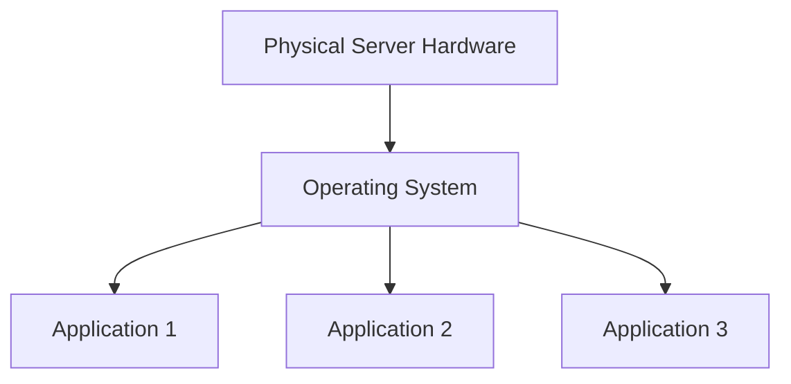
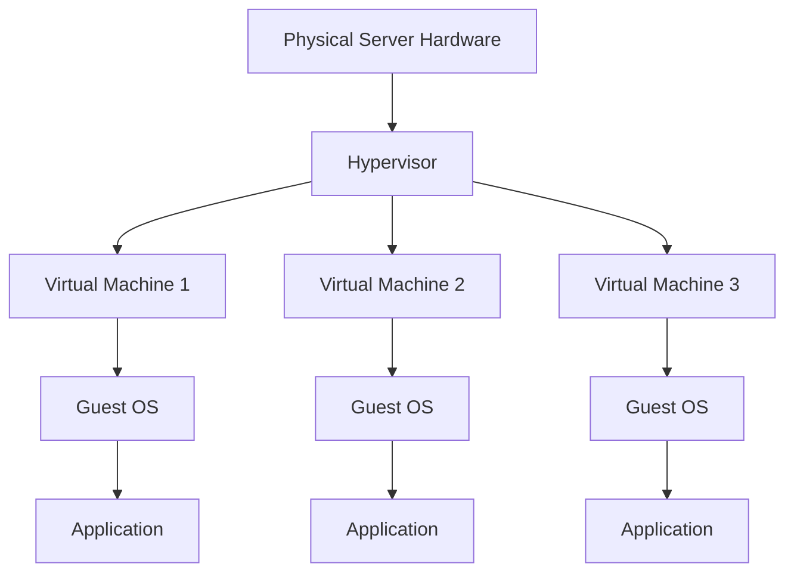
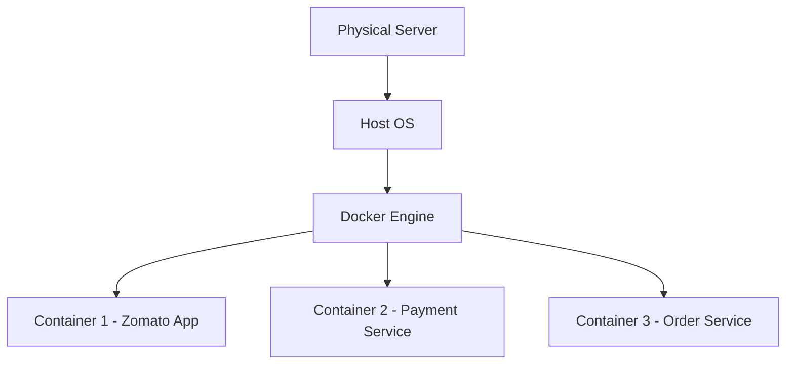

# Docker Documentation

# DevOps Architecture Evolution

This project explains the **evolution of modern application deployment architectures** used in DevOps.

We explore how infrastructure evolved from:

1. **Traditional Physical Servers (Gen-1)**
2. **Virtual Machines & Hypervisors (Gen-2)**
3. **Containerization with Docker (Gen-3)**

Understanding these architectures is essential for **DevOps Engineers, Cloud Engineers, and Software Developers**.

---

# Table of Contents

- [Docker Documentation](#docker-documentation)
- [DevOps Architecture Evolution](#devops-architecture-evolution)
- [Table of Contents](#table-of-contents)
- [Overview](#overview)
- [Gen-1 Architecture (Traditional Physical Server)](#gen-1-architecture-traditional-physical-server)
  - [Architecture Diagram](#architecture-diagram)
  - [Layers Explanation](#layers-explanation)
    - [Physical Layer](#physical-layer)
    - [Operating System Layer](#operating-system-layer)
    - [Application Layer](#application-layer)
  - [Drawbacks](#drawbacks)
- [Gen-2 Architecture (Virtualization)](#gen-2-architecture-virtualization)
  - [Virtualization Architecture](#virtualization-architecture)
- [What is a Hypervisor?](#what-is-a-hypervisor)
  - [Advantages](#advantages)
  - [Drawbacks](#drawbacks-1)
- [Gen-3 Architecture (Containerization)](#gen-3-architecture-containerization)
  - [Container Architecture](#container-architecture)
- [Example Containers](#example-containers)
  - [Advantages of Containers](#advantages-of-containers)
- [Architecture Comparison](#architecture-comparison)
- [Real-World Examples](#real-world-examples)
- [Technologies Used](#technologies-used)
- [Conclusion](#conclusion)

---

# Overview

Modern DevOps infrastructure evolved to solve problems like:

* Resource wastage
* Application dependency conflicts
* Slow deployments
* Poor scalability

The **solution evolved across three generations**:

| Generation | Technology       | Key Idea                          |
| ---------- | ---------------- | --------------------------------- |
| Gen-1      | Physical Servers | Applications run directly on OS   |
| Gen-2      | Virtual Machines | Multiple OS using Hypervisor      |
| Gen-3      | Containers       | Lightweight isolated environments |

---

# Gen-1 Architecture (Traditional Physical Server)

In **Gen-1 architecture**, applications run **directly on a physical server** along with the operating system.

There is **no virtualization or container layer**.

---

## Architecture Diagram

---

## Layers Explanation

### Physical Layer

Actual **hardware server located in a data center**.

Components include:

* CPU
* RAM
* Storage
* Network Interface

Example: Enterprise Data Center Servers.

---

### Operating System Layer

Only **one operating system** runs on the server.

Examples:

* Linux
* Windows Server

All applications **share the same OS kernel**.

---

### Application Layer

Applications run directly on the OS and depend on:

* System libraries
* Runtime environments

Examples:

* Java applications
* Python services
* Node.js applications

---

## Drawbacks

* Application conflicts
* Dependency issues
* Poor scalability
* Resource wastage
* Server crashes affect all applications

---

# Gen-2 Architecture (Virtualization)

Gen-2 introduced **Virtual Machines (VMs)** using **Hypervisors**.

Multiple VMs run on **one physical server**, each with **its own OS and applications**.

---

## Virtualization Architecture

---

# What is a Hypervisor?

A **Hypervisor** is software that creates and manages **Virtual Machines**.

It allows **multiple operating systems to run on one physical server**.

Examples:

| Hypervisor | Provider  |
| ---------- | --------- |
| VMware     | VMware    |
| KVM        | Linux     |
| Hyper-V    | Microsoft |
| VirtualBox | Oracle    |

---

## Advantages

* VM isolation
* Better resource utilization
* Easy VM creation
* VM snapshots for backup
* Multiple OS support

---

## Drawbacks

* Each VM requires full OS
* High CPU and memory usage
* VM startup takes minutes
* Multiple OS kernels waste resources

---

# Gen-3 Architecture (Containerization)

Gen-3 introduced **containers**.

Containers package an application with its dependencies but **share the host OS kernel**.

This makes them **much lighter and faster than virtual machines**.

---

## Container Architecture

---

# Example Containers

| Container   | Service            |
| ----------- | ------------------ |
| Container 1 | Zomato Application |
| Container 2 | Payment Service    |
| Container 3 | Order Service      |

Each container includes:

* Application
* Runtime
* Libraries
* Dependencies

---

## Advantages of Containers

* Lightweight
* Faster startup
* High scalability
* Consistent environments
* Easy CI/CD integration
* Ideal for microservices

---

# Architecture Comparison

| Feature             | Gen-1 | Gen-2  | Gen-3     |
| ------------------- | ----- | ------ | --------- |
| Isolation           | No    | Yes    | Yes       |
| Resource Efficiency | Low   | Medium | High      |
| Startup Time        | Slow  | Medium | Fast      |
| Scalability         | Poor  | Good   | Excellent |

---

# Real-World Examples

| Company | Technology                 |
| ------- | -------------------------- |
| Netflix | Microservices + Containers |
| Amazon  | Cloud Virtual Machines     |
| Google  | Kubernetes Containers      |
| Uber    | Docker + Microservices     |

---

# Technologies Used

* Linux
* Docker
* Virtual Machines
* Hypervisors
* Cloud Computing
* DevOps Practices

---

# Conclusion

Infrastructure evolved from:

**Physical Servers → Virtual Machines → Containers**

Containers are now the **standard for modern cloud-native applications**.

They enable:

* Faster deployments
* Better scalability
* Improved resource efficiency
* Reliable DevOps pipelines
