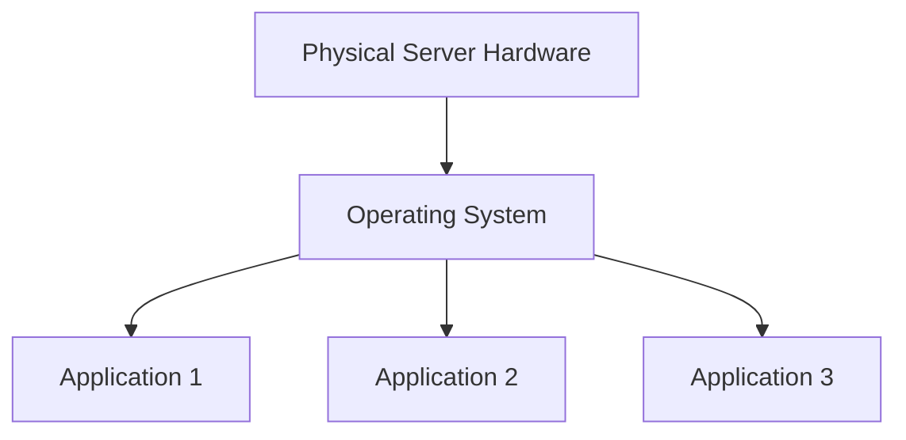
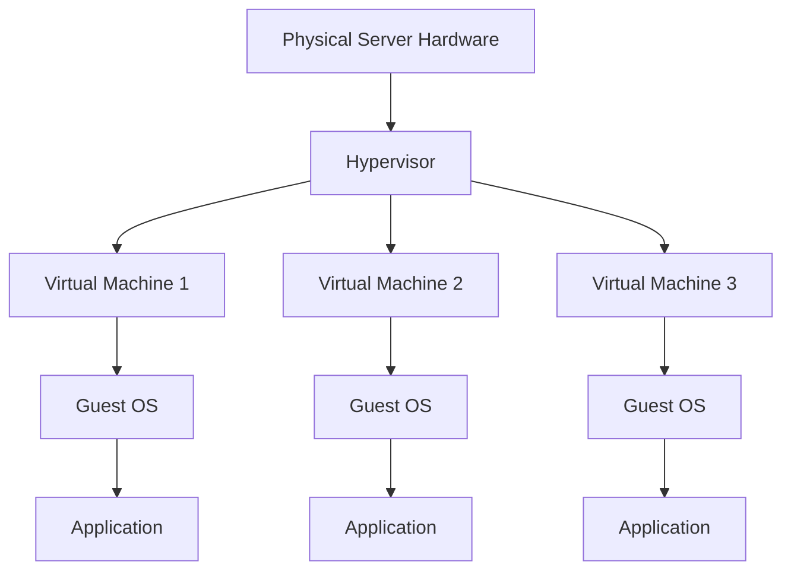
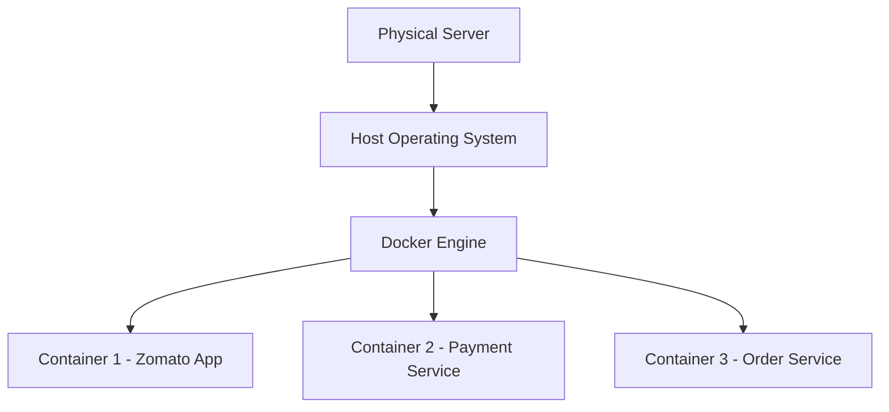

# Docker---Documentation

# 🚀 DevOps Architecture Evolution

This project explains the **evolution of modern application deployment architectures** used in DevOps.

We explore how infrastructure evolved from:

1️⃣ **Traditional Physical Servers (Gen-1)**
2️⃣ **Virtual Machines & Hypervisors (Gen-2)**
3️⃣ **Containerization with Docker (Gen-3)**

Understanding these architectures is essential for **DevOps Engineers, Cloud Engineers, and Software Developers**.

---

# 📚 Table of Contents

# Table of Contents

- [Overview](#overview)
- [Gen-1 Architecture](#gen-1-architecture-traditional-physical-server)
- [Gen-2 Architecture](#gen-2-architecture-virtualization)
- [Gen-3 Architecture](#gen-3-architecture-containerization)
- [Architecture Comparison](#architecture-comparison)
- [Real-World Use Cases](#real-world-use-cases)
- [Technologies Used](#technologies-used)
- [Conclusion](#conclusion)
---

# 📖 Overview

Modern DevOps infrastructure evolved to solve problems like:

* Resource wastage
* Application dependency conflicts
* Slow deployments
* Poor scalability

The **solution evolved across three generations**:

| Generation | Technology       | Key Idea                          |
| ---------- | ---------------- | --------------------------------- |
| Gen-1      | Physical Servers | Applications run directly on OS   |
| Gen-2      | Virtual Machines | Multiple OS using Hypervisor      |
| Gen-3      | Containers       | Lightweight isolated environments |

---

# 🖥 Gen-1 Architecture (Traditional Physical Server)

In **Gen-1 architecture**, applications run **directly on a physical server** along with the operating system.

There is **no virtualization or container layer**.

---

## 🏗 Architecture Diagram

---

## 🧱 Layers Explanation

### 1️⃣ Physical Layer

This is the **actual hardware server** located in a **data center**.

Components include:

* CPU
* RAM
* Storage Disk
* Network Interface

Example:

Enterprise data center servers.

---

### 2️⃣ Operating System Layer

Only **one operating system** runs on the server.

Examples:

* Linux
* Windows Server

All applications **share the same OS kernel**.

---

### 3️⃣ Application Layer

Applications run directly on the OS and depend on:

* System libraries
* Runtime environments

Examples:

* Java applications
* Python services
* Node.js applications

---

## ❌ Drawbacks

* Application conflicts
* Dependency issues
* Poor scalability
* Resource wastage
* Server crashes affect all apps
* Difficult to maintain

---

# 💻 Gen-2 Architecture (Virtualization)

Gen-2 introduced **Virtual Machines (VMs)** using **Hypervisors**.

Multiple VMs run on **one physical server**, each with **its own OS and applications**.

---

## 🏗 Virtualization Architecture

---

# ⚙ What is a Hypervisor?

A **Hypervisor** is software that creates and manages **Virtual Machines**.

It allows **multiple operating systems to run on one physical server**.

---

## Examples of Hypervisors

| Hypervisor | Provider  |
| ---------- | --------- |
| VMware     | VMware    |
| KVM        | Linux     |
| Hyper-V    | Microsoft |
| VirtualBox | Oracle    |

---

## Cloud Examples

Cloud providers use virtualization.

Examples:

* AWS EC2
* Azure Virtual Machines
* Google Compute Engine

---

## ✅ Advantages

* VM isolation
* Better resource utilization
* Easy VM creation
* Snapshots for backup
* Multiple OS support

---

## ❌ Drawbacks

* Each VM requires full OS
* High CPU and memory usage
* VM startup takes minutes
* Multiple OS kernels waste resources
* OS licensing cost

---

# 🐳 Gen-3 Architecture (Containerization)

Gen-3 introduced **containers**.

Containers package an application with its dependencies but **share the host OS kernel**.

This makes them **much lighter and faster than virtual machines**.

---

## 🏗 Container Architecture

---

# 📦 Example Containers

| Container   | Service            |
| ----------- | ------------------ |
| Container 1 | Zomato Application |
| Container 2 | Payment Service    |
| Container 3 | Order Service      |

Each container includes:

* Application
* Runtime
* Libraries
* Dependencies

---

## 🚀 Advantages of Containers

* Lightweight
* Faster startup (seconds)
* High scalability
* Consistent environments
* Easy CI/CD integration
* Perfect for microservices

---

## Tools Used in Containerization

| Tool           | Purpose                    |
| -------------- | -------------------------- |
| Docker         | Container runtime          |
| Kubernetes     | Container orchestration    |
| Docker Compose | Multi-container apps       |
| Helm           | Kubernetes package manager |

---

# 📊 Architecture Comparison

| Feature             | Gen-1 | Gen-2       | Gen-3     |
| ------------------- | ----- | ----------- | --------- |
| Isolation           | ❌     | ✅           | ✅         |
| Resource Efficiency | ❌     | ⚠️          | ✅         |
| Startup Time        | Slow  | Medium      | Fast      |
| Scalability         | Poor  | Good        | Excellent |
| OS Requirement      | 1 OS  | Multiple OS | Shared OS |
| Deployment Speed    | Slow  | Medium      | Very Fast |

---

# 🌍 Real-World Examples

| Company | Technology                 |
| ------- | -------------------------- |
| Netflix | Microservices + Containers |
| Amazon  | Cloud Virtual Machines     |
| Google  | Kubernetes Containers      |
| Uber    | Docker + Microservices     |

---

# 🛠 Technologies Used

* Linux
* Docker
* Virtual Machines
* Hypervisors
* Cloud Computing
* DevOps Practices

---

# 🎯 Conclusion

Infrastructure has evolved significantly:

**Physical Servers → Virtual Machines → Containers**

Containers are now the **standard architecture for cloud-native applications**.

They enable:

* Faster deployments
* Better scalability
* Improved resource efficiency
* Reliable DevOps pipelines

---

